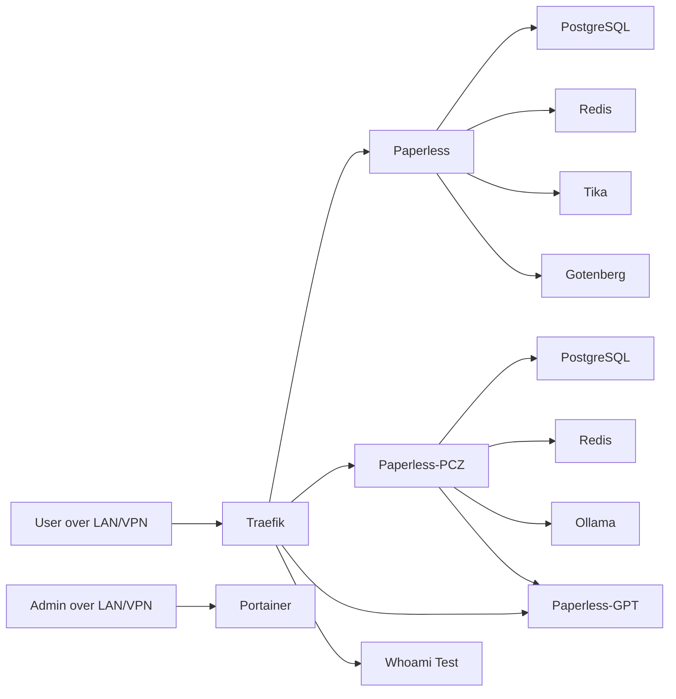

# Architecture

This document reflects the live topology observed on `lportainer` and the sanitized compose exports now stored in the repo.

## Topology

The host currently runs several independent Docker compose projects managed through Portainer and local compose files:

- `traefik`
- `paperless`
- `paperless-pcz`
- `paperless-core`
- `paperless-ai`
- `paperless-pcz-gpt`

## Role Of Each Project

- `traefik`: shared reverse proxy and dashboard
- `paperless`: one Paperless instance with dedicated PostgreSQL and Redis
- `paperless-pcz`: second Paperless instance with dedicated PostgreSQL and Redis
- `paperless-core`: helper services shared by Paperless workloads
- `paperless-ai`: Ollama service
- `paperless-pcz-gpt`: AI helper application for the `paperless-pcz` instance

## Network Shape

- `proxy` is the ingress network used by Traefik and routed services
- `paperless_backend` is used by the `paperless` instance
- `paperless-pcz_backend` is used by the `paperless-pcz` instance
- an additional `paperless` network is shared by several containers, including helpers and AI-related services

## Traffic Flow

- Traefik accepts traffic on host ports `80` and `443`
- Paperless and related routed services are selected through Traefik labels on the `proxy` network
- Portainer is currently published directly on host ports and is not behind the `proxy` network
- PostgreSQL and Redis are not published on host ports

## Current Design Observation

The live design is functional but not yet cleanly standardized:

- there are two Paperless instances
- there is a mix of shared and per-instance networks
- storage uses Docker named volumes
- most live stacks are now mirrored in sanitized form in this repository
- Portainer itself is still not represented as a recovered compose stack

## Reference Diagram

## Risk Notes

- The VM remains a single failure domain.
- The live stack is not yet fully represented by this repo.
- Named-volume storage makes host-level backup visibility weaker than the earlier bind-mount target design.
- The observed Traefik routing/TLS configuration should be reviewed before treating HTTPS as fully standardized.
